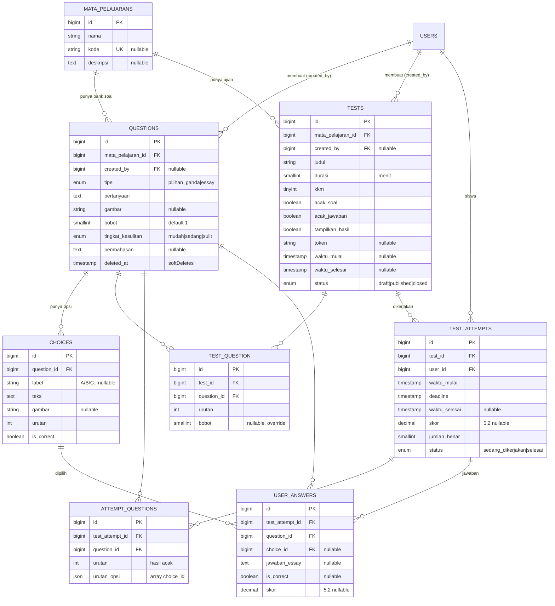

# Desain Database — Aplikasi CBT

Dokumen ini menjelaskan skema database aplikasi CBT (Laravel 12 + Filament 3 +
Livewire 3, PostgreSQL). Skema ini sudah terpasang dan tervalidasi di database.

## Daftar Isi
- [Diagram ERD](#diagram-erd)
- [Tabel](#tabel)
- [Relasi](#relasi)
- [Alasan Desain (Normalisasi)](#alasan-desain-normalisasi)

---

## Diagram ERD



> Catatan: `TEST_QUESTION` adalah tabel pivot untuk relasi many-to-many
> `QUESTIONS ↔ TESTS`. Mermaid menggambarkannya sebagai dua relasi one-to-many.

---

## Tabel

### `mata_pelajarans`
Master mata pelajaran. Menaungi bank soal dan ujian.

| Kolom | Tipe | Keterangan |
|---|---|---|
| id | bigint PK | |
| nama | string | mis. "Matematika" |
| kode | string unique nullable | mis. "MTK" |
| deskripsi | text nullable | |
| timestamps | | |

### `questions` — bank soal
Soal milik **mata pelajaran**, bukan ujian, sehingga dapat dipakai ulang.

| Kolom | Tipe | Keterangan |
|---|---|---|
| id | bigint PK | |
| mata_pelajaran_id | FK → mata_pelajarans (cascade) | |
| created_by | FK → users (nullOnDelete) | pembuat soal |
| tipe | enum(pilihan_ganda, essay) | |
| pertanyaan | text | |
| gambar | string nullable | path gambar pendukung |
| bobot | smallint default 1 | poin soal |
| tingkat_kesulitan | enum(mudah, sedang, sulit) | filter & analitik |
| pembahasan | text nullable | |
| timestamps + softDeletes | | soal terpakai tak di-hard-delete |

### `choices` — opsi jawaban
Satu baris per opsi → jumlah opsi tak terbatas.

| Kolom | Tipe | Keterangan |
|---|---|---|
| id | bigint PK | |
| question_id | FK → questions (cascade) | |
| label | string(2) nullable | "A"/"B"/… |
| teks | text | |
| gambar | string nullable | |
| urutan | int | urutan tampil |
| is_correct | boolean | kunci jawaban menempel di opsi |

### `tests` — ujian / exam
| Kolom | Tipe | Keterangan |
|---|---|---|
| id | bigint PK | |
| mata_pelajaran_id | FK → mata_pelajarans | |
| created_by | FK → users nullable | |
| judul, deskripsi | string/text | |
| durasi | smallint | menit |
| kkm | tinyint | nilai minimal lulus |
| acak_soal, acak_jawaban, tampilkan_hasil | boolean | |
| token | string nullable | token akses |
| waktu_mulai, waktu_selesai | timestamp nullable | jadwal |
| status | enum(draft, published, closed) | |

### `test_question` — pivot penyusun ujian
| Kolom | Tipe | Keterangan |
|---|---|---|
| id | bigint PK | |
| test_id | FK → tests (cascade) | |
| question_id | FK → questions (restrict) | tak bisa dihapus jika dipakai |
| urutan | int | urutan default di ujian |
| bobot | smallint nullable | override bobot khusus ujian |
| unique(test_id, question_id) | | cegah soal ganda |

### `test_attempts` — sesi ujian (exam session)
| Kolom | Tipe | Keterangan |
|---|---|---|
| id | bigint PK | |
| test_id | FK → tests | |
| user_id | FK → users | siswa |
| waktu_mulai | timestamp | |
| deadline | timestamp | batas server-authoritative |
| waktu_selesai | timestamp nullable | |
| skor | decimal(5,2) nullable | nilai akhir 0–100 |
| jumlah_benar | smallint | |
| status | enum(sedang_dikerjakan, selesai) | |
| unique(test_id, user_id) | | 1 sesi per siswa per ujian |

### `attempt_questions` — snapshot acak per siswa
| Kolom | Tipe | Keterangan |
|---|---|---|
| id | bigint PK | |
| test_attempt_id | FK → test_attempts (cascade) | |
| question_id | FK → questions (restrict) | |
| urutan | int | urutan soal hasil acak |
| urutan_opsi | json | array choice_id terurut |
| unique(test_attempt_id, question_id) | | |

### `user_answers` — jawaban per soal
| Kolom | Tipe | Keterangan |
|---|---|---|
| id | bigint PK | |
| test_attempt_id | FK → test_attempts (cascade) | |
| question_id | FK → questions | |
| choice_id | FK → choices nullable | pilihan utk PG |
| jawaban_essay | text nullable | |
| is_correct | boolean nullable | null = belum dinilai (essay) |
| skor | decimal(5,2) nullable | |
| unique(test_attempt_id, question_id) | | 1 jawaban/soal → autosave upsert |

---

## Relasi

```
mata_pelajarans 1───∞ questions ∞───∞ tests        (via test_question)
mata_pelajarans 1───∞ tests
questions       1───∞ choices
users           1───∞ tests        (created_by)
users           1───∞ questions    (created_by)

tests           1───∞ test_attempts ∞───1 users     (siswa)
test_attempts   1───∞ attempt_questions ∞───1 questions   (snapshot)
test_attempts   1───∞ user_answers ∞───1 questions
user_answers    ∞───1 choices
```

- **MataPelajaran → Question**: one-to-many (bank soal per mapel)
- **Question ↔ Test**: many-to-many via `test_question` (soal reusable)
- **Question → Choice**: one-to-many (opsi tak terbatas)
- **Test → TestAttempt**: one-to-many (banyak siswa)
- **TestAttempt → UserAnswer**: one-to-many (satu jawaban per soal)
- **TestAttempt → AttemptQuestion**: one-to-many (snapshot urutan)

---

## Alasan Desain (Normalisasi)

**1NF — atomik, tanpa kolom berulang.**
Opsi jawaban dipecah ke tabel `choices`, bukan kolom `opsi_a..opsi_d`. Ini
memenuhi kebutuhan "banyak opsi": jumlah opsi bebas tanpa ubah skema dan tak ada
kolom kosong.

**2NF — atribut bergantung penuh pada PK.**
Di pivot `test_question`, `urutan` dan `bobot` bergantung pada kombinasi
(test_id, question_id), maka ditaruh di pivot — bukan di `questions` (urutan bukan
milik soal) maupun di `tests`.

**3NF — hilangkan ketergantungan transitif.**
- Kunci jawaban (`is_correct`) ada di `choices`, bukan teks "jawaban_benar = B"
  di `questions` → tak ada duplikasi/inkonsistensi.
- `skor` di `test_attempts` adalah nilai turunan, namun sengaja **disimpan**
  (denormalisasi terukur) untuk performa rekap & arsip historis. Dihitung sekali
  oleh `App\Services\ScoringService` saat submit.

**Keputusan desain kunci:**

| Keputusan | Alasan |
|---|---|
| Bank soal lepas dari ujian (pakai pivot, bukan `questions.test_id`) | Soal reusable lintas ujian; hapus ujian tak menghapus soal. |
| `attempt_questions` (snapshot) | Pengacakan deterministik per siswa; navigasi stabil; kebal perubahan bank soal saat ujian. |
| `unique(test_attempt_id, question_id)` di `user_answers` | Autosave via upsert — satu baris jawaban per soal. |
| `softDeletes` + `restrictOnDelete` pada soal | Soal terpakai tak hilang → integritas nilai & audit. |
| `deadline` di attempt | Timer server-authoritative, anti manipulasi jam browser. |

---

## Alur Nilai Otomatis (ringkas)

1. Siswa mulai → `ExamSessionService::startOrResume()` membuat `test_attempts`
   + snapshot `attempt_questions` (acak per siswa).
2. Tiap menjawab → upsert ke `user_answers` (autosave).
3. Submit / waktu habis → `ScoringService::grade()` menilai pilihan ganda,
   mengisi `is_correct` & `skor` tiap jawaban, lalu `skor` + `jumlah_benar` di
   `test_attempts`. Skor = (Σ bobot benar / Σ bobot soal PG) × 100.
